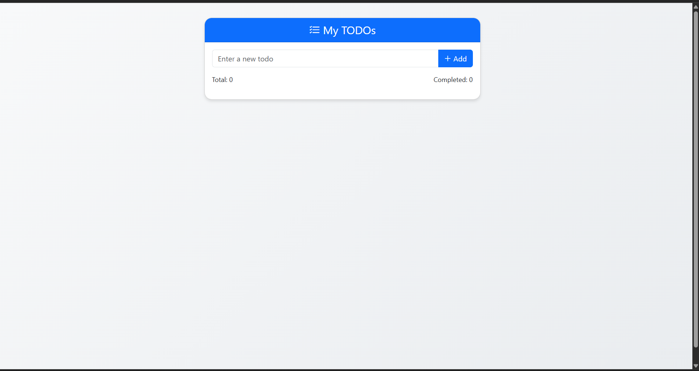
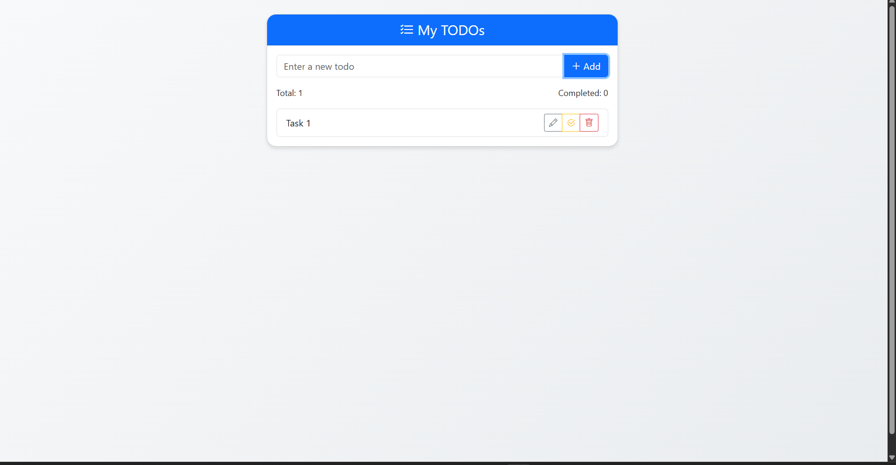
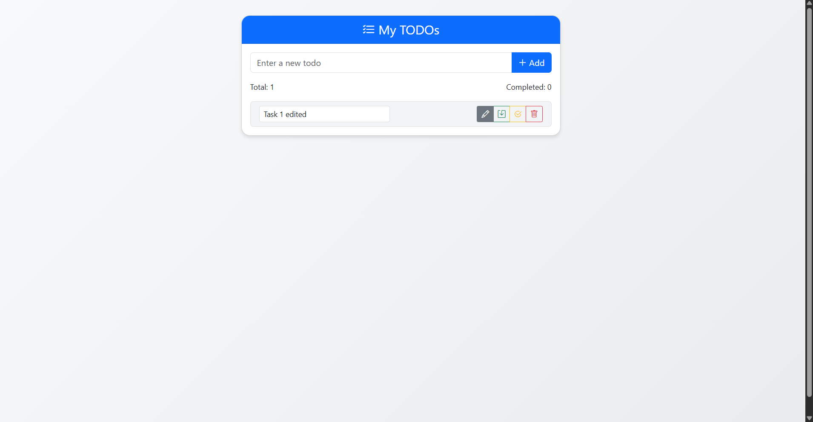
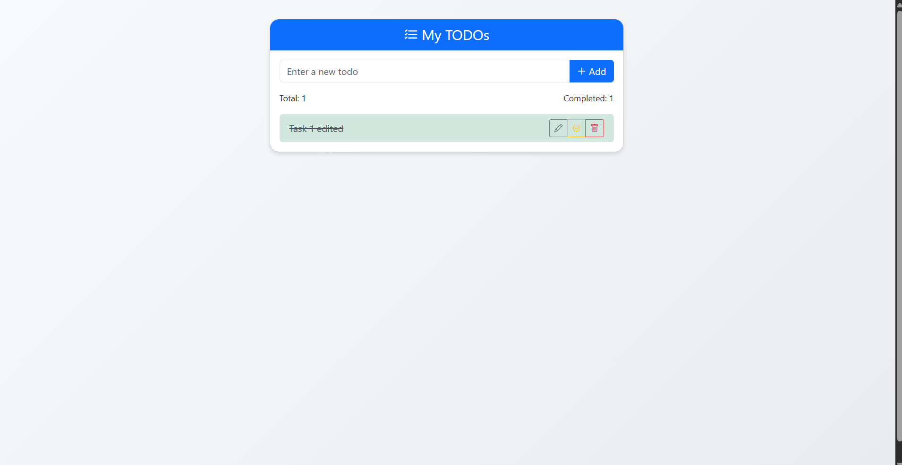

# 📋 TODO App (Node.js + File-Based Backend)

A simple and beautiful TODO list application with a custom Node.js backend that stores data in a JSON file — no database required!

## ✨ Preview



---

## 🧪 Demo Features

### ➕ Add Todo


### ✏️ Edit Todo


### ✅ Complete Todo


---

## 🚀 Features

- ✅ Add new todos
- ✏️ Edit existing todos
- ✅ Mark todos as completed/uncompleted
- 🗑️ Delete todos
- 💾 Data persistence using `todo.json`
- 🎨 Bootstrap + custom CSS for clean UI
- 🌐 Full frontend-backend integration with CORS support

---

## 🛠️ Tech Stack

| Layer     | Tech Used              |
|-----------|------------------------|
| Frontend  | HTML, CSS, Bootstrap 5, JavaScript |
| Backend   | Node.js (native `http` module, no framework) |
| Storage   | Local file: `todo.json` |

---

## 🧪 How to Run

### 1. Clone the Repo
```bash
git clone https://github.com/BuggyPratiK/Todo-App.git
cd Todo-App
```

### 2. Start the Backend
```bash
node server.js
```
You’ll see:
```
Server running at http://localhost:3000
```

### 3. Open the Frontend
- Just double-click `index.html` to open in your browser

---

## 🔐 CORS Fix
This app uses `file://` to open HTML + `localhost` for backend, so CORS headers are added in `server.js`:
```js
res.setHeader("Access-Control-Allow-Origin", "*");
```

---

## 📦 Future Enhancements
- Add login system with localStorage or sessions
- Switch backend to Express.
- Add filter/search and dark mode

---

## 🙌 Author
**Pratik Mahajan** (@BuggyPratiK)

If you like this, give the repo a ⭐ on GitHub!

---

> Built with 💻, 🔧, and ☕ during a full-stack project assignment
